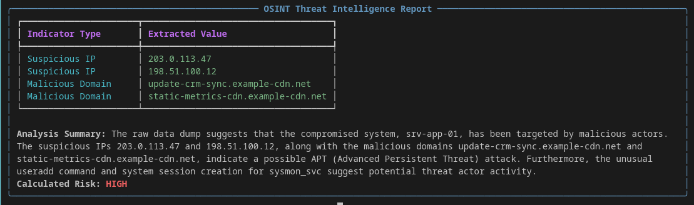

# OSINT Threat Analyzer

A command-line tool that extracts indicators of compromise from raw log files and renders risk-ranked terminal reports. Runs entirely on your own machine. No log data is ever sent to a third-party service.



---

## Why this exists

I spent over a decade doing investigative work, private investigations, and before that internal fraud and theft investigations in a corporate security department. A large part of that job was reading through volumes of unstructured material looking for the handful of things that mattered, then writing it up in reports.

That work was almost entirely manual. This is the tool I wished existed.

## Why it runs on-device

Investigative material is confidential. In the work I came from, sending case data to a third-party API would have been a non-starter legally, contractually, and ethically.

So the language model runs locally through [Ollama](https://ollama.com). Log files are read from disk, analyzed in memory, and printed to the terminal. Nothing leaves the machine, and the tool requires no API keys or credentials. That constraint shaped the architecture, and it is why this is a local CLI rather than a web service.

## Why the output is schema-validated

Language models produce fluent text whether or not the content is correct. A hallucinated IP address inside a threat report is worse than no report at all, because it looks authoritative and someone may act on it.

This project constrains the model twice:

1. **At generation.** The Pydantic model's JSON schema is passed to Ollama as the required response format, so the model is constrained to that shape while generating.
2. **At parsing.** The response is validated with `ThreatReport.model_validate_json()`. Anything that does not conform (a missing field, a wrong type) raises a `ValidationError` and is logged rather than displayed.

The report can still be wrong about the world. It cannot be structurally invalid, and failures are loud instead of silent.

---

## What it does

- Reads a raw log file from disk
- Extracts indicators of compromise (IOCs): suspicious IP addresses, malicious domains, and threat-actor aliases
- Assigns an overall risk level and a written analysis summary
- Renders the result as a colour-coded terminal report via [Rich](https://github.com/Textualize/rich)

## Requirements

- Python 3.10+ (developed on 3.12)
- [Ollama](https://ollama.com) 0.5.0 or later, running locally
- The `llama3` model pulled
- After activating the virtual environment, verify it took effect:
`which python3` should point inside `venv/bin/`, not `/usr/bin/`.

## Installation

```bash
git clone https://github.com/Alex-Smolcic/osint_threat_analyzer.git
cd osint_threat_analyzer

python3 -m venv venv
source venv/bin/activate          # Windows: venv\Scripts\activate

pip install -r requirements.txt
```

Pull the model:

```bash
ollama pull llama3
```

## Usage

```bash
python3 src/main.py -f samples/sample_auth.txt
```

| Flag | Description |
|---|---|
| `-f`, `--file` | Path to the log file to analyze (required) |

A fabricated sample log is included in `samples/` so the tool can be run without supplying your own data.

---

## Project structure

```
osint_threat_analyzer/
├── src/
│   ├── main.py            CLI entry point
│   ├── log_parser.py      File reading and validation
│   ├── llm_engine.py      Schema definition, model call, response validation
│   └── report_writer.py   Terminal rendering
├── samples/               Fabricated log data for testing
├── data/                  Local working directory (git-ignored)
└── requirements.txt
```

| Module | Responsibility |
|---|---|
| `main.py` | Parses arguments, wires the pipeline, handles top-level failures and exit codes |
| `log_parser.py` | Reads the log file from disk; validates the path and handles read errors |
| `llm_engine.py` | Defines the `ThreatReport` schema, calls the local model with that schema as the required format, validates the response |
| `report_writer.py` | Renders validated results as a Rich table and panel, colour-coded by risk level |

Logging is configured once in `main.py` and each module uses a named logger, so a failure at any stage surfaces with context rather than a bare traceback.

### The schema

```python
class ThreatReport(BaseModel):
    suspicious_ips: List[str]
    malicious_domains: List[str]
    threat_actor_aliases: List[str]
    risk_level: str
    analysis_summary: str
```

This is the contract between the model and the rest of the program. Nothing reaches the report layer without conforming to it.

---

## Status and roadmap

An active personal project, not a finished product.

**Working now**
- File-based log ingestion
- Schema-constrained local inference with validation
- Colour-coded risk reporting in the terminal

**Planned**
- Constrain `risk_level` to a fixed set of values rather than a free string, so invalid levels are rejected at the schema rather than defaulted at the display layer
- Chunking for log files larger than the model's context window
- Enrichment against external reputation feeds, so risk scoring has an independent source to check against
- Structured export (JSON, CSV) for handoff into other tooling
- Unit tests for the parsing and validation paths

## Security notes

- No log data leaves the local machine
- No API keys or credentials are required or stored
- `.env`, `*.pem`, `secrets.json`, `data/` and `*.log` are excluded from version control
- All sample data in this repository is fabricated; the IP ranges used are IETF-reserved documentation addresses

## License

MIT

---

Built by [Alex Smolcic](https://github.com/Alex-Smolcic) · [alex@smolcic.ca](mailto:alex@smolcic.ca) · [LinkedIn](https://www.linkedin.com/in/alex-smolcic)